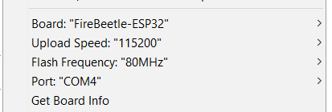
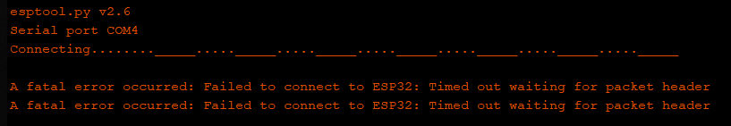

# Dragonframe With OPTI
Arduino library aiming at repurposing the OPTI camera slider family for the Dragonframe stop motion animation software.

More on OPTI sliders: http://opti.net.pl \
More on Dragonframe: https://www.dragonframe.com  

## Instalation
1. Follow the instructions for installing Arduino IDE and ESP-32 board core:\
https://github.com/espressif/arduino-esp32/blob/master/docs/arduino-ide/boards_manager.md \
> Note: There have been problems reported about uploading at higher speeds. You can use them if it works for you.

2. Install required libraries in `Sketch > Include Library > Manage Libraries...`:
    *  TMC2208Stepper

3. Install the prerequisite libraries\
    * https://github.com/KarolStola/Opti
    * https://github.com/KarolStola/DragonframeMotionController

4. Clone this project repository and open it in Arduino Studio

5. Under the `Tools` dropdown, setup the following:\

6. After pressing `Upload`, make sure to hold the "BOOT" button on board, or you might receive the following error:\

5. If you release the "BOOT" button after the code has been uploaded, you will have to press the "EN" button to restart it.

6. Make sure you have either the battery or external PSU connected, because it is required to power the motor.

7. Connect the OPTI device as any regular bluetooth device with your computer.

8. Follow the instructions on motion control in Dragonframe manual:\
https://www.dragonframe.com/download/Using%20Dragonframe%204.pdf
